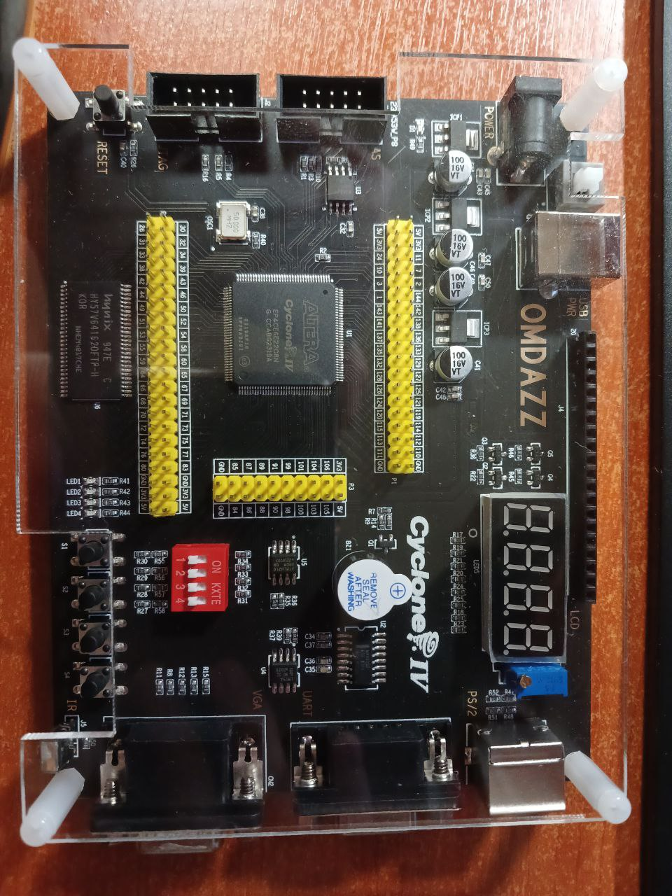

# FPGA

## Работа с ПЛИС (FPGA)

#### Дата начала: 29.03.2024

> Дата обновления: 29.03.2024

## FPGA Cyclone IV EP4CE6E22C8N

### Харакеристики Cyclone IV EP4CE6E22C8N

- Микросхемой платы разработки является `Altera EP4CE6E22C8N`
- USB программатор-бластер для программирования ПЛИС
- Основной чип: `ALTERA Cyclone IV EP4CE6E22C8N`
- Плата с `16Mbit EPCS16N` чипом последовательной конфигурации, пользователь может загружать и отлаживать программный код через `JTAG` интерфейс или `AS` интерфейс
- Плата с `64Mbit SDRAM`, поддержка разработки `SOPC, NIOSII`
- Микросхема регулятора напряжения:
  - Использование микросхемы регулятора напряжения `1117-3.3V` для обеспечения выходного напряжения `3.3V`.
  - Использование микросхемы регулятора напряжения `1117-1.2V` для обеспечения напряжения ядра FPGA.
  - Использование микросхемы регулятора напряжения `1117-2.5 В` для обеспечения выходного напряжения `PLL`.
- Входное напряжение: `DC 5V`. Плата также может быть запитана через интерфейс `USB`
- Интерфейс отладки и загрузки программ：

  - JTAG интерфейс: загрузка файла `.SOF`, скорость быстрая. Нет потери данных после отключения питания.
  - Интерфейс `AS`: загрузка файла `.POF`. Нет потери данных после сбоя питания.

- Интерфейс расширения: шаг `2,54 мм`.
- Размер: `136 мм * 106 мм`.

### Состав комплекта
- Плата разработки EP4CE6 FPGA
- USB Blaster Programmer
- SB-кабель